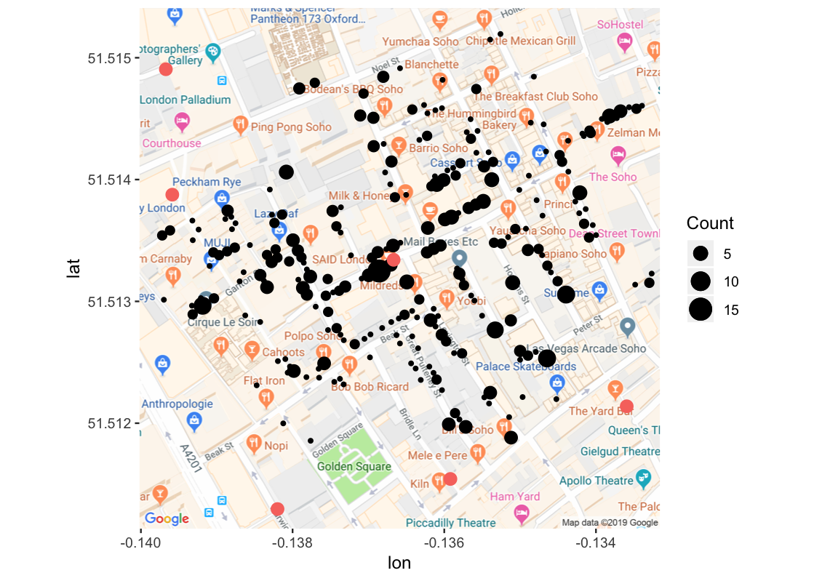

## Cholera Deaths

```{r, echo = FALSE, message = FALSE, warning = FALSE}
library(mdsr) 
library(sp) 
library(rgdal) 
library(mapproj)
library(ggmap)
```

&#35;  다음 그림과 같이 John Snow 의 콜레라 사망자와 펌프 간의 관계를 공간정보로 파악하고자 한다. 각 코드가 어떤 역할을 하는지 코드 밑에 매우 간략하게 설명하시오.

```{r, echo = FALSE}

```

가. `dsn <- "../data/SnowGIS_SHP"`  

나. `CholeraDeaths <- readOGR(dsn, layer = "Cholera_Deaths")`

다. `proj4string(CholeraDeaths) <- CRS("+init=epsg:27700")`

라. `Cholera_latlong <- CholeraDeaths %>% spTransform(CRS("+init=epsg:4326"))`

마. `Pumps <- readOGR(dsn, layer = "Pumps")`

바. `proj4string(CholeraDeaths) <- CRS("+init=epsg:27700")`

사. `Pumps_latlong <- Pumps %>% spTransform(CRS("+init=epsg:4326"))`
        
아. `m <- get_map("John Snow, London, England", zoom = 17, maptype = "roadmap")`

자. `ggmap(m) +`
  
차. 

```{r, echo = TRUE, eval = FALSE}
geom_point(data = as.data.frame(Cholera_latlong),
           aes(x = coords.x1, 
               y = coords.x2,
               size = Count)) +
```

카. 

```{r, echo = TRUE, eval = FALSE}
geom_point(data = as.data.frame(Pumps_latlong),
           aes(x = coords.x1,
               y = coords.x2,
               size = 3, 
               colour = "red")) +
```

타. `guides(colour = "none")`
